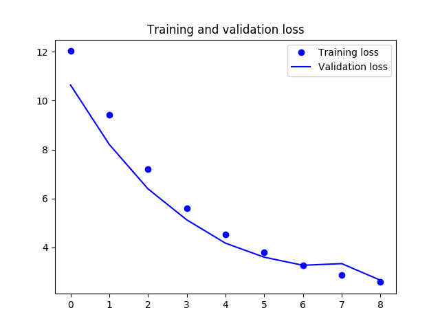
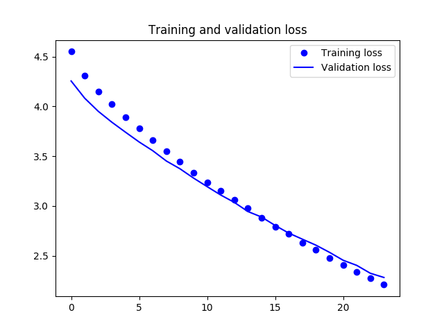

# food_classifier : A production quality service for food images classification based on deep learning in keras.

----

## Installation

```bash
$ git clone repo-url
$ cd repo-dir
$ python setup.py install
```

## Project API

- food_classifier/api.py : creates a flask service to serve the prediction models.
- food_classifier/data_preprocess.py : downloads the dataset from the internet and split into train/validation/test tiers.
- food_classifier/inference.py : loads the trained models then provides predict() and predict_on_batch() methods.
- food_classifier/metrics_computer.py : computes evaluation metrics for each trained models and per tier: train/validation/test.
- food_classifier/models.py : defines two deep learning architectures: base_model and mobilenet_model.
- food_classifier/train.py : highly flexible script to train a given model architecture with different params painlessly.
- food_classifier/utils.py : utility functions mkdir_p and remove_childreen to create/clean a directory respectively.
- food_classifier/requirements.txt : project dependencies, (duplicates from setup.py but needed to run in docker)
- food_classifier/run__preprocess_and_train.sh : install dependencies, create necessary directories, download the dataset, split it and train the model.
- food_classifier/run__food_classifier_service.sh: serves the trained models as a flask rest service.

- food_classifier/downloads/ : folder where the raw dataset is downloaded and extracted. (in .gitignore)
- food_classifier/data/ : folder where the train/validation/test tiers are saved. (in .gitignore)
- food_classifier/history_plots/ : folder where the train history is plotted, mainly loss_func and val_score over epochs. (in .gitignore)
- food_classifier/logs/ : folder where each module reports its logs. (in .gitignore)
- food_classifier/model_ckpts/ : folder where the model checkpoints are saved. (in .gitignore)

- tests/ : contains tests for some modules.

## How to run

### Locally without docker

Easy: just make sure  every script is ran from the food_classifier/food_classifier directory.

- ./run__preprocess_and_train.sh :
After running this script the mobilenet_model architeture will be trained and saved to disk.
You can compute its metrics scores and make inference on images using the metrics_computer or inference modules.

- ./run__food_classifier_service.sh :
You can also launch the service which by default will run on localhost and port 8383.
Hence visiting this link  in your web browser:

```bash
localhost:8383/predict?model_type=base_model&image_path=data/train/sushi/train_26.jpg
```

should return a similar result to this :

```python
{
  "confidence": "0.804221",
  "label": "sushi",
  "label_idx": "1"
}
```

### Within docker

- first build the docker image:
```bash
docker build -t food-cls
```
This will automatically download the dataset, split it and train the mobilenet_model (default architecture)


- commit your changes in a new image:
```bash
docker commit <container-id> food-cls-trained
```

- launch the prediction microservice:
```bash
docker run -it --entrypoint /home/junior/food_classifier/run__food_classifier_service.sh -p 8383:8383 food-cls-trained
```

- make a query to the microservice similarly as before but make sure to use your machine's ip address, not localhost.


## Implementations specifications and constraints

- deep learning approach
- production quality code, easily deployable.
- potentially embed the model on a mobile phone. Hence good framework candidates: tensorflow, keras, caffe2.
- short amount of time (eg: a weekend) and fairly 'easy' classification problem. Hence chosen framework: keras.
- very little amount of data: ~1K images in total. Hence, chosen model architectures should fight overfitting as much as possible.


## Models

Two different architectures have been trained: base_model and mobilenet_model.
The have different architectures but have in common the fact that they are lightweights (~3M params, ~22MegaBits) so we can meet the above constraints.

###  base_model :  The baseline architecture

- a classic convolutional deep neural net
- Counter-overfitting techniques used: early-stopping, batch-norm, dropout, regularization. These are very important given the very small amount of data we have.


### mobilenet_model : The default trained and served architecture

- use the very lightweight mobilenet model as a feature extractor. Hence its layers are frozen, the last dense layer replaced.
- append a trainable convolution layer before the dense layer to cut down the number of params from ~6M to ~3M.


## Results analysis

### base_model

- train_scores:
```python
{'recall': 0.91496, 'accuracy': 0.83724, 'precision': 0.79188, 'f1': 0.84898}
```

- validation_scores:
```python
{'recall': 0.82500, 'accuracy': 0.75000, 'precision': 0.71739, 'f1': 0.76744}
```

- test_scores:
```python
{'recall': 0.90476, 'accuracy': 0.71429, 'precision': 0.65517, 'f1': 0.76000}
```

As we can notice, the baseline model overfits the dataset despite all the strategies mentioned above.
Also the recall is very high compared to the precision meaning that the model tends to missclassify one category more than the other.

<p align="center"></p>
FIGURE:  base_model validation loss decreasing over epochs.

### mobilenet_model

- train_scores:
```python
{'recall': 0.92962, 'accuracy': 0.95161, 'precision': 0.97239, 'f1': 0.95052}
```

- validation_scores:
```python
{'recall': 0.90000, 'accuracy': 0.91250, 'precision': 0.92308, 'f1': 0.91139}
```

- test_scores:
```python
{'recall': 0.90476, 'accuracy': 0.88095, 'precision': 0.86364, 'f1': 0.88372}
```

The first observation is that: the mobilenet_model is better than the base_model even though it trained faster and more important
the original mobilenet weights were trained on imagenet which doesn't contains much images similar to the ones in our dataset.

Also we can notice, the mobilenet_model slightly overfits the dataset but by a small margin in comparison.
Likewise, the recall is sligthly high compared to the precision but much better than for the base_model.

(key take-away: fine-tuning is awesome)


<p align="center"></p>
FIGURE:  mobilenet validation loss decreasing over epochs.

The comparison of the two plots shows that the base_model loss has a long path to go from ~13.0 to ~1.0.
Whereas, the mobilenet_model converges much more quickly since its loss starts from ~4.5.


## Moving to production:

- Since we have used keras, to move to production we can export our keras graph into a tensorflow graph and use tensorflow serving capabilities.
The procedure can be found here : https://github.com/tensorflow/serving/issues/310

- Furthermore, given its relatively small weight, the model can be embeded in a mobile app.

- We can use the inference.py and metrics_computer.py modules to write a Quality Assurance service to monitor our model online.

- Easily deployable into a docker container service given api.py module and the Dockerfile provided.


## Going further:

The followings can help us make the service better and faster:

- Thrift: better serialization than the current json format of our service.
- Redis: to add a caching layer on top of our service.
- Kafka: to service the model in a distributed environment.
- Getting more training data.

